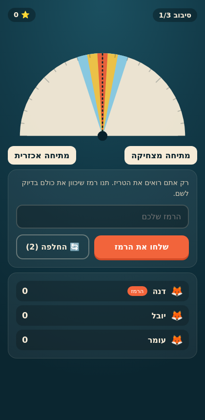

# אורך גל · Hebrew Wavelength

קלון עברי (RTL) של משחק **Wavelength** לכמה מכשירים, שרץ כולו בדפדפן — **בלי שרת משלנו ובלי בנייה (build)**.



## מה זה

בכל סיבוב שחקן אחד הוא **הרמז**: הוא רואה ספקטרום (למשל *מכוער ↔ יפה*) ונקודת מטרה חבויה עליו,
ואומר מילה או ביטוי שיכוונו את שאר השחקנים בדיוק לשם. כולם מזיזים מחט על חוגה ונועלים ניחוש.
ככל שקרוב יותר — יותר נקודות (4 / 3 / 2 / 0), והרמז מקבל את ממוצע הנקודות של המנחשים.

- **1,146 ספקטרומים** ב-13 חפיסות (`js/data/packs/`) — המארח בוחר אילו חפיסות בשימוש.
- **מספר סיבובים** נקבע על ידי המארח (ברירת מחדל 3).
- כל שחקן רשאי **להחליף קלף עד n-1 פעמים** לאורך המשחק (n = מספר הסיבובים).
- אחרי שלב הניחוש מגיע **שלב התוצאות**, והמארח הוא זה שמעביר לסיבוב הבא.
- בסוף — פודיום, טבלת ניקוד וסיכום כל הסיבובים.

## שלוש דרכי חיבור

| מצב | איך מצטרפים | צריך אינטרנט? |
| --- | --- | --- |
| 📶 **רשת מקומית** | המארח מציג QR, השחקן סורק ומציג QR בחזרה. חיבור WebRTC ישיר. | לא — עובד על נקודה חמה סגורה |
| 🔗 **קוד חדר** | המארח מקבל קוד בן 4 תווים, השחקנים מקלידים אותו. | כן, לאיתות בלבד (PeerJS) |
| 🖥️ **מכשיר אחד** | כמה כרטיסיות באותו דפדפן (BroadcastChannel). | לא — להדגמה ולפיתוח |

> **למה לא Bluetooth?** דפדפן יכול לשמש רק כ-*central* ב-Web Bluetooth, לא כ-*peripheral*,
> ולכן אי אפשר לחבר שני דפדפנים זה לזה ב-BLE. המקבילה הפרקטית היא WebRTC על הרשת המקומית —
> זה מה שמימשנו, וזה עובד גם כשאין אינטרנט בכלל.

בחיבור "רשת מקומית" ה-SDP נדחס מ-~1.5KB ל-**כ-200 תווים** (`js/net/sdp.js`) כדי שייכנס לקוד QR יחיד.

## הרצה

```bash
# כל שרת סטטי מספיק - אין שלב בנייה
python3 -m http.server 8000
# ואז http://localhost:8000
```

לשימוש אמיתי בין מכשירים צריך **HTTPS** (דרישה של המצלמה ו-WebRTC). הדרך הפשוטה: GitHub Pages —
הריפו כולל workflow שמפרסם את הענף הראשי אוטומטית. אחרי ביקור ראשון אחד, ה-Service Worker
שומר את האפליקציה במטמון והיא נטענת גם בלי אינטרנט (חשוב למצב "נקודה חמה").

## מבנה הקוד

```
index.html              שלד הדף
css/style.css           העיצוב (RTL, בהשראת אפליקציית Wavelength)
js/app.js               ניתוב מסכים והחזקת הסשן הפעיל
js/data/packs/*.js      תוכן: חפיסות הספקטרומים
js/game/engine.js       לוגיקת משחק טהורה (ניקוד, סיבובים, צנזור תצוגה)
js/game/session.js      HostSession (מקור האמת) ו-ClientSession
js/net/transports.js    שלוש דרכי החיבור מאחורי ממשק אחד
js/net/rtc.js           חיבור WebRTC ישיר עם ערוץ נתונים
js/net/sdp.js           דחיסת SDP לקוד QR
js/ui/dial.js           רכיב החוגה (SVG)
js/ui/screens/*.js      מסכים: בית, הגדרות, הצטרפות, לובי, סיבוב, סיום
js/vendor/              PeerJS, qrcode-generator, jsQR (נטענים רק כשצריך)
```

**המארח הוא מקור האמת.** הלקוחות שולחים פעולות (`clue`, `guess`, `swap`…) ומקבלים בחזרה
תצוגת מצב מצונזרת: `viewFor()` מסתיר את המטרה מכל מי שאינו הרמז, ואת הניחושים של האחרים
עד שלב החשיפה — כך שאי אפשר לרמות דרך ה-DevTools.

## הוספת חפיסה

יוצרים קובץ ב-`js/data/packs/` לפי אותו מבנה (`{ id, name, emoji, desc, pairs }`),
מייבאים אותו ב-`js/data/packs.js` ומוסיפים למערך `PACKS`. זה הכול.
בכל זוג, האיבר הראשון הוא **הקצה הימני** של החוגה (כיוון הקריאה בעברית).
